 # Animals MVC

Професионален ASP.NET Core MVC проект за каталог от животни с търсене, детайлен изглед и роля за администратор. Приложението използва Identity за регистрация/вход и Entity Framework Core със SQL Server.

## Основни възможности

- CRUD за животни (Create/Edit/Delete са достъпни само за Admin).
- Търсене по име или тип.
- Детайлен изглед с галерия и навигация към предишно/следващо животно.
- Identity автентикация и роли (Admin/User).
- Seed на роли и администратор при старт.

## Технологии

- ASP.NET Core MVC (.NET 8)
- Entity Framework Core (SQL Server)
- ASP.NET Core Identity
- Bootstrap + Bootstrap Icons

## Бърз старт

1. Конфигурирай връзката към базата в `appsettings.json`.
2. Създай база и приложи миграциите:

```bash
dotnet ef database update
```

3. Стартирай проекта:

```bash
dotnet run
```

По подразбиране приложението стартира на:

- https://localhost:7152
- http://localhost:5279

## Конфигурация

В `appsettings.json` е зададена връзка към SQL Server Express:

```
Server=localhost\SQLEXPRESS;Database=AnimalDB;Trusted_Connection=True;MultipleActiveResultSets=true;Encrypt=False;
```

Ако имаш друга инстанция или база, промени стойността на `ConnectionStrings:ApplicationDbContext`.

## Достъп на администратор

При първото стартиране се създават роли `Admin` и `User`, както и администратор:

- Email: `admin@admin.com`
- Password: `Admin123!`

## Изображения на животни

Моделът `Animal` има поле `ImageFiles`, което приема списък от имена на файлове, разделени със запетая. Файловете трябва да са в `wwwroot/images/animals`.

Логиката за визуализация:

- Ако `ImageFiles` е попълнено, се използват първите изображения.
- Ако е празно, се търсят файлове по шаблон `{id}-*.*` (например `5-kotka-luna.jpg`).
- Ако няма съвпадения, се пробва `animal-{id}.*`.
- За списъка и резултатите има fallback към `{id}-preview.jpg` и накрая към `animal-1.svg`.

## Структура на проекта (основно)

- `Controllers/` – MVC контролери
- `Models/` – домейн модели
- `Data/` – DbContext и seed логика
- `Views/` – Razor изгледи
- `Areas/Identity/` – Identity страници
- `wwwroot/` – статични ресурси (CSS, JS, изображения)

## Screenshots

Ето визуални примери от приложението.

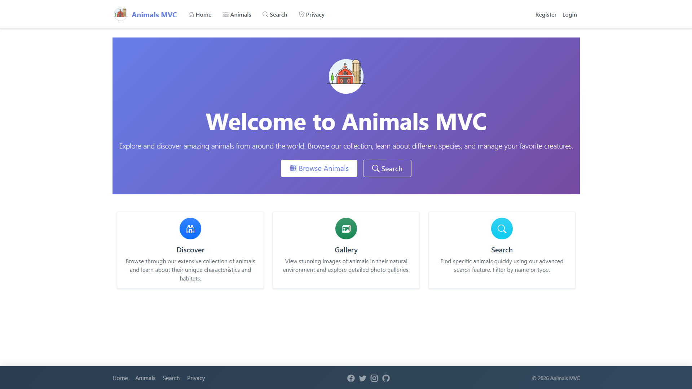
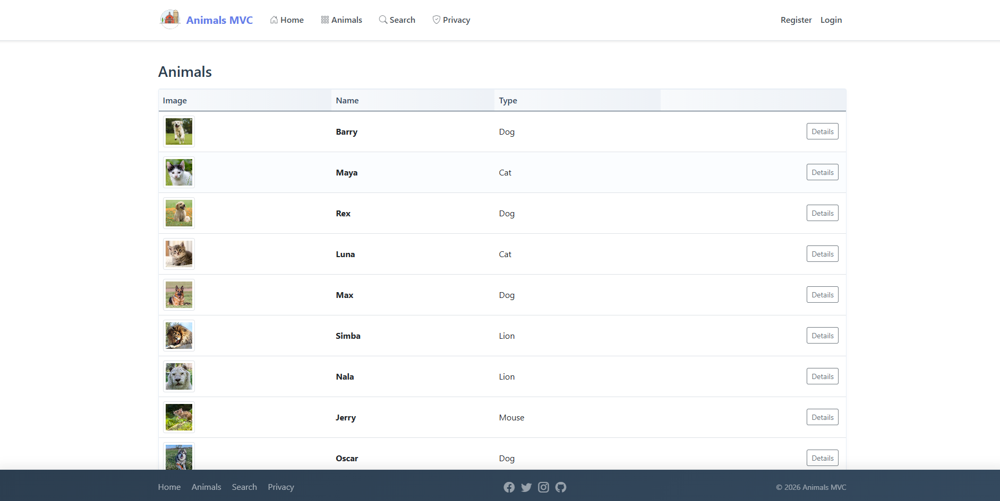
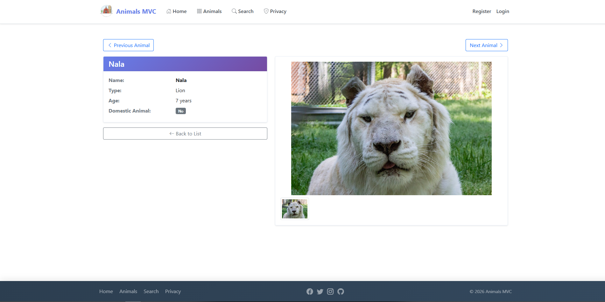
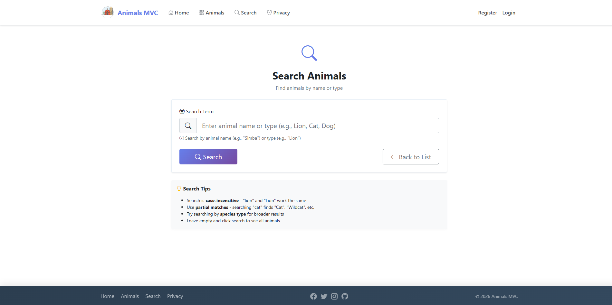
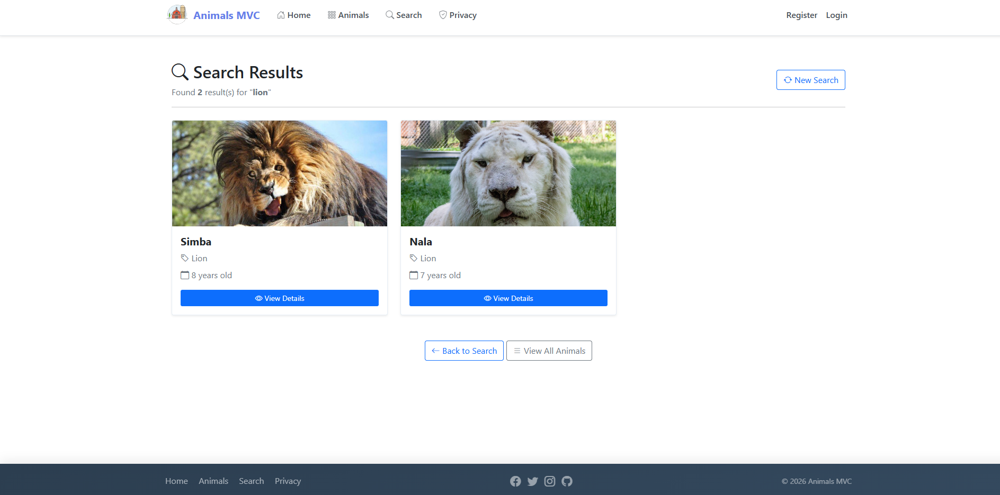
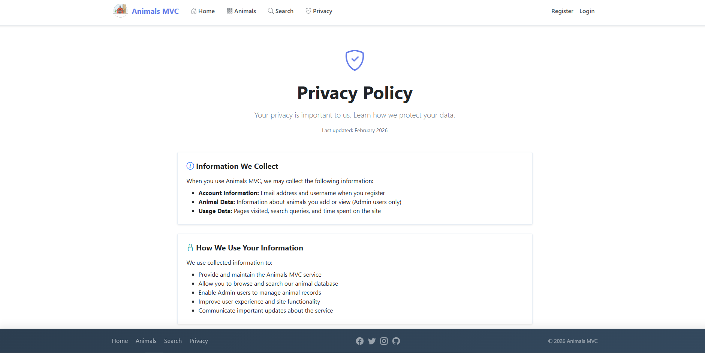
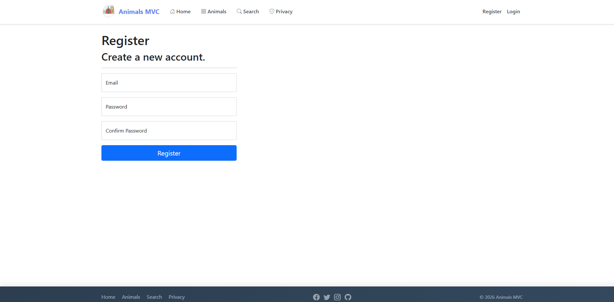
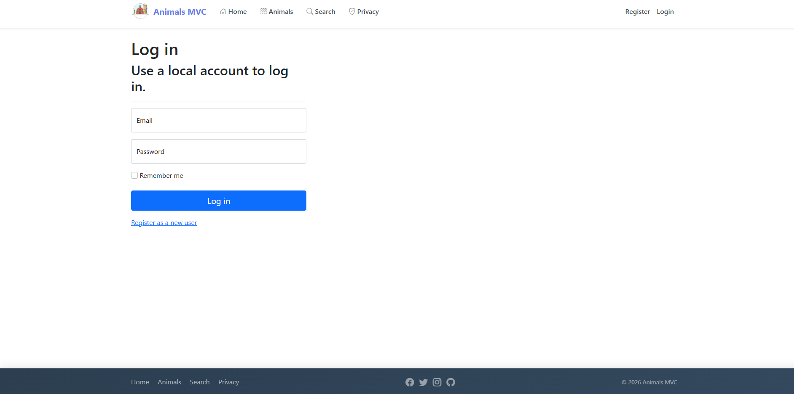
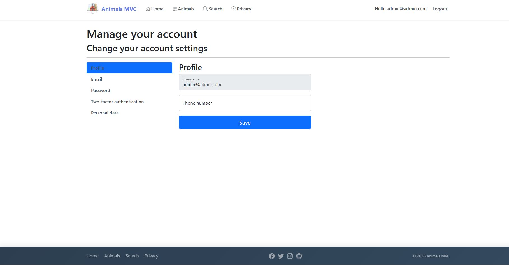
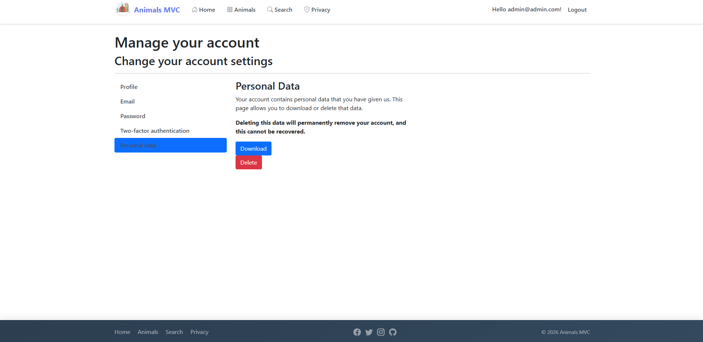
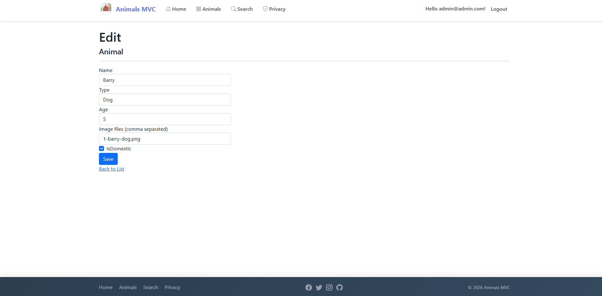

## SQL данни (ръчно добавяне)

Изпълни следния скрипт срещу базата, ако искаш да заредиш примерни записи в таблицата `Animal`:

```sql
INSERT INTO [Animal] ([Id], [Name], [Type], [Age], [IsDomestic], [ImageFiles]) VALUES
(1,  'Barry', 'Dog',    5, 1, '1-barry-dog.png'),
(2,  'Maya',  'Cat',    3, 1, '2-maya-cat.png'),
(3,  'Rex',   'Dog',    7, 1, '3-rex-dog.png'),
(4,  'Luna',  'Cat',    2, 1, '4-luna-cat.png'),
(5,  'Max',   'Dog',    4, 1, '5-max-dog.png'),
(6,  'Simba', 'Lion',   8, 0, '6-simba-lion.png'),
(7,  'Nala',  'Lion',   7, 0, '7-nala-lion.png'),
(8,  'Jerry', 'Mouse',  1, 0, '8-jerry-mouse.png'),
(9,  'Oscar', 'Dog',    6, 1, '9-oscar-dog.png'),
(10, 'Bella', 'Cat',    5, 1, '10-bella-cat.png'),
(11, 'Rio',   'Parrot', 12, 1, '11-rio-parrot.png'),
(12, 'Coco',  'Monkey', 9, 0, '12-coco-monkey.png'),
(13, 'Tommy', 'Dog',    3, 1, '13-tommy-dog.png'),
(14, 'Snowy', 'Rabbit', 2, 1, '14-snowy-rabbit.png'),
(15, 'Bruno', 'Bear',   10, 0, '15-bruno-bear.png');
```

Ако имаш включен identity колона за `Id`, махни колоната `Id` от списъка и стойностите.

